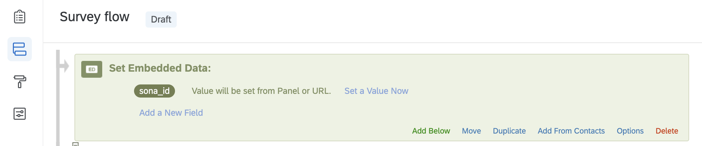
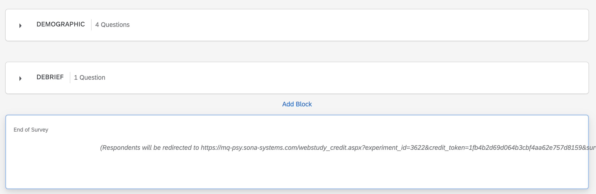

# How to redirect participants from SONA to jsPsych, and then to Qualtrics, and finally to SONA again?

<div style="text-align: left; font-size: 130%">
Omid Ghasemi

<span style="font-size: 80%">Department of Cognitive Science, Macquarie University<span>
</div>

Suppose you host an experiment which is created with jsPsych on Pavlovia. You also have another experiment on Qualtrics. In this experiment, participants will be redirected from SONA to jsPsych to do the first part of the experiment. Then, they well be redirected to Qualtrics to do the second part of the experiment. Finally, they will be returned to SONA and will be granted their credit. You want to capture participants SONA ID so that you can make the credit assignment automatic, and more importantly, combine data in jsPsych and Qualtrics using a unique code. You can simply follow these simple steps:


1. According to the SONA + jsPsych help page [here](https://www.sona-systems.com/help/jspsych.aspx), add `?sona_id=%SURVEY_CODE%` to the end of the URL. So, your URL would look like this:

<div style="text-align: center;">

https://run.pavlovia.org/yourname/exp_name/?sona_id=%SURVEY_CODE%

</div>

2. Then, inside your jsPsych experiment, fist capture the SONA IDs (i.e., sona_id) using this:

```js
let sona_id = jsPsych.data.urlVariables()['sona_id']
```

This line of code extracts participants SONA ID from the URL and saves it as a variable named `sona_id`.

3. Now, you want to redirect participants to Qualtrics. First, you need to add `?sona_id=` to the end of your Qualtrics URL. Then, inside the `jsPsych.init` function, you add the link to the `on-finish` parameter and append your variable `+sona_id` to the end of the URL.

```js
  jsPsych.init({
    timeline: timeline,
    on_finish: function(data) {
      document.body.innerHTML = '</br></br></br><h1 style= "text-align: center; color: darkgreen;"> Please wait. You will be redirected to a new website in a few seconds.</h1>'
      setTimeout(function () { location.href = "https://your.institute.qualtrics.com/form/rD7TKChg?sona_id=" +sona_id}, 15000)
    }
  })
```

4. now, you need to capture the SONA ID in the Qualtrics experiment. To do so, go to the survey flow panel (at the left of your screen, below the builder tab) and simply add an **Set Embedded Data** block at the beginning of your experiment. the, change the name of the variable to `sona_id`.




5. Now, you need to redirect participants back to SONA. When you created your experiment on SONA, SONA created a completion URL for you. You need to copy this URL, which is something like this:

<div style="text-align: center;">

https://mq-psy.sona-systems.com/webstudy_credit.aspx?experiment_id=36&credit_token=1f&survey_code=XXXX
</div>

6. Remove the `XXXX` from the end of the URL and add `${e://Field/sona_id}` so the code would look like this:

<div style="text-align: center;">

https://mq-psy.sona-systems.com/webstudy_credit.aspx?experiment_id=36&credit_token=1f&survey_code=${e://Field/sona_id}
</div>

7. Finally, at the end of the survey (in the builder tab), there is a block named **End of Survey**. Add your edited URL there.



8. Sit down, relax, and enjoy your coffee while participants are doing your experiment and getting their course credit automatically.

**Note**: If your ethics committee does not allow you to capture or publish participants IDs, then you have to either create a random ID for each participant or do the same procedure but remove IDs from your final dataset.